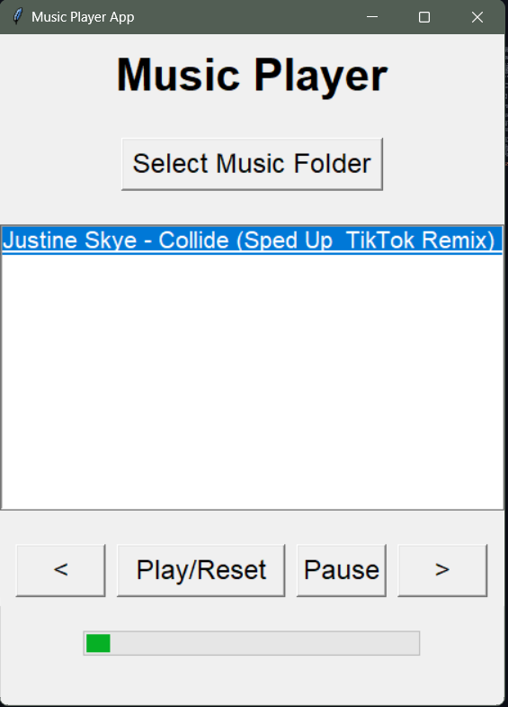

#Music Player App
This is a simple music player application developed using Python and the Tkinter GUI library.

##Prerequisites
Here are some prerequisites that can help you navigate and understand the project:

- Learn about basic Tkinter widgets (Label, Button, Listbox, Progressbar)
- Basic understanding of Pygame, particularly the pygame.mixer.music module, which is used for music playback in the project.

##Libraries/Modules Used:

####Tkinter:

Used for creating the graphical user interface.
Modules: tk, filedialog, ttk.

####Threading:

Utilized for running the progress bar update function in a separate thread to prevent blocking the main UI thread.

####Pygame:

Used for audio playback features, including playing, pausing, and reset music.

####Mutagen:
Employed for extracting information about MP3 files, such as song duration.

####OS and Time:
OS module is used for interacting with the operating system, specifically for reading files in the selected music folder.
Time module is utilized for introducing delays in the progress bar update loop.

## Methods

- global: global variable means that this variable is not defined within the function but is accessible and can be modified globally.
- pygame.mixer.music.get_busy():It is used to determine whether the music playback is currently active or not. It returns boolean value
- pygame.mixer.music.get_pos():It represents the elapsed time in milliseconds since the music playback started.

##Screen Shot

