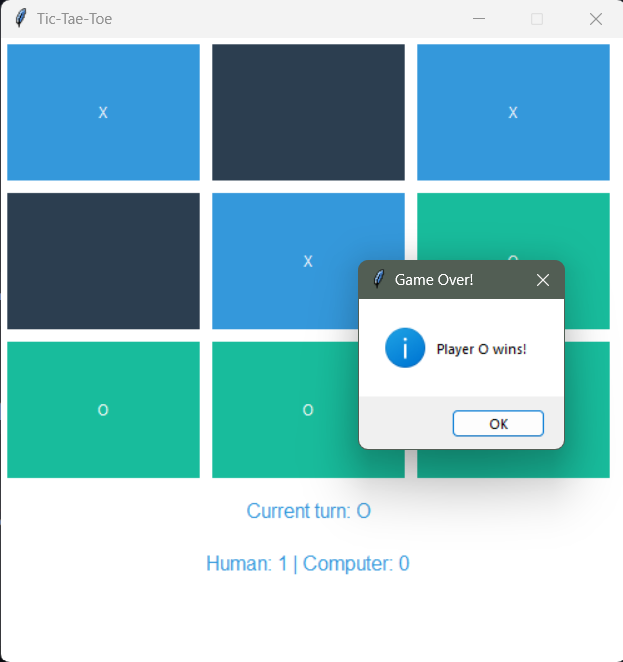

#Tic-Tac-Toe Game
The Tic-Tac-Toe game is a simple desktop application implemented in Python using the Tkinter library. It allows users to play the classic Tic-Tac-Toe game against a computer opponent.

###Dependencies
Tkinter: Used for creating the graphical user interface.
ttkbootstrap: Provides additional styles for Tkinter widgets.

##Screen Shot

